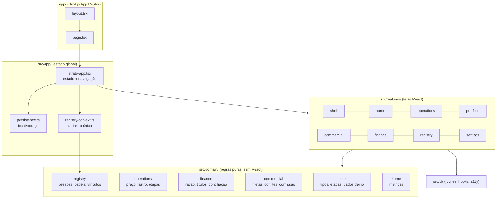
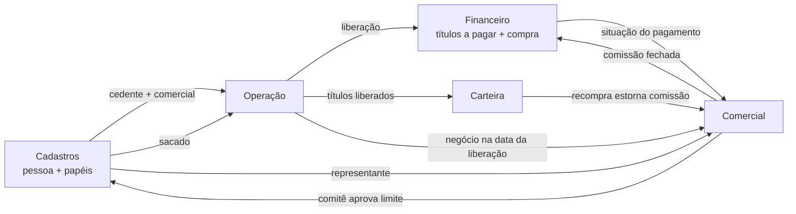

# Arquitetura do STRATO

Protótipo navegável de uma plataforma operacional de recebíveis (factoring, securitizadora, FIDC). Roda inteiro no navegador: não há backend, os dados são de demonstração e o estado fica no `localStorage`. O código já está organizado como seria numa aplicação real, para que a troca por uma API seja localizada.

## 1. Visão em camadas



Regras de dependência (valem como contrato):

| Camada | Pode importar | Não pode importar |
|---|---|---|
| `src/domain` | outros módulos de `src/domain` | React, `src/features`, `src/app`, `src/ui` |
| `src/features/<x>` | `src/domain`, `src/ui`, `src/app/registry-context`, `src/features/shell/shell-context` e peças compartilhadas de outra feature quando explícito (ex.: `finance-ui`) | estado de outra feature |
| `src/app` | tudo acima | — |
| `app/` (rotas) | `src/app`, `src/features/shell/theme` | — |

Isso deixa o domínio testável sem navegador (ver `tests/`) e permite trocar a origem dos dados sem mexer nas telas.

## 2. Mapa de pastas

```
app/                         Rotas do Next (página única) e CSS global
  layout.tsx                 Fontes, metadados, script de tema antes da pintura
  page.tsx                   Monta <StratoApp />
  globals.css                Índice dos estilos (ver seção 6)
  styles/                    tokens.generated.css, legacy.css, commercial.css, design-system.css
src/
  app/
    strato-app.tsx           Raiz: estado global, navegação por view, providers
    persistence.ts           Chaves e migração do localStorage
    registry-context.ts      Contexto do cadastro único (cedentes, pessoas, comercial)
  domain/
    core/                    Entidades (types.ts), etapas (stages.ts), formatação, dados de demonstração (demo/)
    operations/              Precificação, lastro, diagnóstico por etapa, ritmo, automação, criação da operação
    finance/                 Plano de contas (model.ts), razão (ledger.ts), títulos, bancos, liberações,
                             relatórios, conciliação OFX, importação de plano de contas, implantação
    commercial/              Tipos, calendário, regras (atribuição, métricas, comissão), ações, seed
    registry/                Pessoas e papéis (parties.ts), gravação com propagação (party-save.ts),
                             vínculo cedente↔comercial e eventos da carteira (registry.ts)
    home/                    Métricas da Visão geral e parâmetros (metas, cenários)
  features/
    shell/                   Menu, barra superior, busca Ctrl K, alertas, tema, páginas de roadmap
    home/                    Visão geral (perfis Gestão, Operação, Risco)
    operations/              Central, Nova operação e o workspace com as 6 etapas
      central/ new-operation/ workspace/ entry/ risk/ lastro/ pricing/ approval/ release/ components/
    portfolio/               Carteira (títulos, por cedente, por comercial, atraso)
    commercial/              Comercial (painel, carteira, negócios, contas novas, visitas, funil, comitês, comissões)
    finance/                 Financeiro (caixa, títulos, liberações, extrato, conciliação, contábil, bancos)
    registry/                Cadastros (pessoas com papéis, cedentes, sacados)
    settings/                Preferências da interface
  ui/                        Ícones, pressable (a11y), useElementWidth
tests/                       Vitest: documentos, cadastro, preço, financeiro, comercial
tools/theme_tokens.py        Gera tokens claro/escuro a partir de cores literais do CSS
.preview/                    Vite puro (sem Next) para rodar e para gerar a página única publicável
docs/                        Esta documentação e os documentos de produto (docs/produto)
```

Cada arquivo começa com um comentário dizendo o que ele faz. Nenhum arquivo de componente passa de ~700 linhas; os painéis grandes foram divididos em subcomponentes, um hook de estado (`use-*.ts`) e um modelo puro (`*-model.ts`) na mesma pasta.

## 3. Estado, persistência e navegação

`src/app/strato-app.tsx` é o único dono do estado global:

| Estado | Tipo | Chave no localStorage |
|---|---|---|
| operações | `Operation[]` | `lastro-mvp-operations-v3` |
| sacados | `Debtor[]` | `lastro-mvp-debtors-v1` |
| financeiro | `FinanceState` | `strato-finance-v2` |
| comercial | `CommercialState` | `strato-commercial-v1` |
| pessoas do Cadastro | `Party[]` | `strato-parties-v1` |
| explicações na interface | `boolean` | `lastro-interface-guidance-v1` |
| tema, menu recolhido, perfil/período da Visão geral | preferências do usuário | `strato-theme`, `strato-sidebar-collapsed`, `strato-home-*` |

- A restauração acontece uma vez, depois de montar (`loadPersistedState`), e mescla o que foi salvo com os dados de demonstração atuais (migração tolerante a campos novos).
- "Restaurar dados de demonstração" (busca global) chama `clearPersistedState` e recria o seed.
- Não há roteador de URL: `view` (`home`, `operations`, `portfolio`, `commercial`, `finance`, `registry`, `policies`, `integrations`) escolhe o módulo e `selected` abre o workspace de uma operação.

Dois contextos descem da raiz:

- `ShellContext` (`features/shell/shell-context.ts`): operações, navegar, abrir operação, nova operação, preferências, restaurar demonstração. Usado pelo shell, pela busca e pelos alertas.
- `RegistryContext` (`app/registry-context.ts`): cedentes efetivos (limite do comitê aplicado), pessoas do Cadastro, estado comercial com os eventos da carteira e as ações `saveParty` e `onCommercial`.

## 4. Vínculos entre módulos (ciclo fechado)



Regras implementadas (arquivo de referência entre parênteses):

- O CNPJ/CPF é a chave de tudo; uma pessoa pode ter vários papéis (`domain/registry/parties.ts`).
- Gravar um cadastro propaga: sacado entra na digitação, representante vira comercial, cedente cria ou transfere o vínculo com o comercial (`domain/registry/party-save.ts`).
- O limite do cedente vem da decisão do comitê (`effectiveCedents` em `domain/registry/registry.ts`).
- A operação grava o comercial responsável quando nasce (`domain/operations/create-operation.ts`); o negócio conta na data da liberação para o dono do cliente naquela data (`repAt`, `liveDeals` em `domain/commercial/rules.ts`).
- Liberação gera títulos a pagar e o lançamento da compra (`domain/finance/releases.ts`).
- Recompras feitas nas operações viram eventos da carteira e estornam comissão (`repurchaseEvents` + `computeCommission`).

## 5. Padrões do domínio

- **Funções puras que devolvem resultado:** ações retornam `{ state, error?, message?, effects? }` (`Result` no financeiro, `CResult` no comercial). A tela aplica o novo estado ou mostra o erro; nada lança exceção para a interface.
- **Transação no financeiro:** `run(state, fn)` trabalha num rascunho (`draftOf`), e `post` recusa lançamento desbalanceado. Se qualquer passo falha, o estado original fica intacto.
- **Nada é apagado:** títulos são excluídos com motivo e estorno, baixas são estornadas por contrapartida, operações são canceladas com memória, cadastros são inativados.
- **Uma fonte por cálculo:** a precificação (`domain/operations/pricing.ts`) é a mesma para Preço, Aprovação, Visão geral e Comercial; o parser monetário (`parseMoneyBR`) é único no financeiro.
- **Datas** em ISO `AAAA-MM-DD` no estado; formatação `dd/mm/aaaa` só na tela.

## 6. Estilos e tema

`app/globals.css` importa, nesta ordem:

1. `styles/tokens.generated.css` — cada cor das telas legadas vira `var(--c-<papel>-<hex>)` com valor claro e escuro, gerados por `tools/theme_tokens.py` a partir do papel da cor (texto, fundo, borda, destaque). Não editar à mão.
2. `styles/legacy.css` — estilos das telas de operação, Visão geral (`vg-`) e Financeiro (`fn-`).
3. `styles/commercial.css` — Comercial (`cm-`).
4. `styles/design-system.css` — tokens semânticos `--ds-*`, shell (`sx-`), componentes novos (`ds-`, `rg-`, `pf-`) e a camada visual por cima das telas legadas.

Estilos novos usam os tokens `--ds-*`, que já têm valor claro e escuro. O tema é `data-theme="light|dark"` no `<html>`, com a preferência do usuário (claro, escuro ou sistema) salva em `strato-theme`.

## 7. Testes e qualidade

```
npm run check     # typecheck + lint + formatação + testes
npm test          # Vitest (tests/*.test.ts)
```

- Testes cobrem as regras que mais custam caro se quebrarem: dígitos de CPF/CNPJ, validação e propagação do cadastro, métodos de deságio, partidas dobradas e estorno, parser monetário, atribuição e comissão.
- ESLint roda sem erros nem avisos. As poucas exceções (`eslint-disable`) têm o motivo escrito ao lado — em geral, restauração do localStorage depois de montar.
- `worker/` e `vite.config.ts` ficam fora do typecheck: dependem de tipos do Cloudflare e de `build/sites-vite-plugin`, que é gerado pelo ambiente de hospedagem e não vem no repositório.

## 8. Como fazer mudanças comuns

- **Nova regra de negócio:** escreva a função em `src/domain/<área>/`, sem React, com teste em `tests/`. A tela só chama a função.
- **Nova tela num módulo:** crie o componente em `src/features/<módulo>/` (ou numa subpasta da etapa) e ligue na aba ou na etapa correspondente.
- **Novo módulo no menu:** acrescente a `view` em `AppView` (`shell-context.ts`), o item em `navigation.tsx` e o `case` de renderização em `strato-app.tsx`.
- **Novo papel no Cadastro:** acrescente em `PartyRole`, `partyRoles`, `PartyRoleData` e `defaultRoleData` (`parties.ts`), a ficha em `party-role-fields.tsx` e as colunas em `parties-tab.tsx`.
- **Trocar a demonstração por API:** substitua os `initial*`/`seed*` e o `persistence.ts` por chamadas ao backend; as funções de domínio continuam as mesmas.

## 9. Limitações conhecidas

- Sem backend, autenticação, perfis ou trilha de auditoria real; o usuário é fixo ("Henrique").
- Integrações (Receita, SEFAZ, bureaus, bancos, assinatura) são simuladas.
- Políticas e Integrações ainda são páginas de escopo; parâmetros de crédito e preço estão no código das etapas.
- Backlog detalhado em [produto/REVISAO_V6.md](./produto/REVISAO_V6.md) e [produto/HANDOFF.md](./produto/HANDOFF.md).
