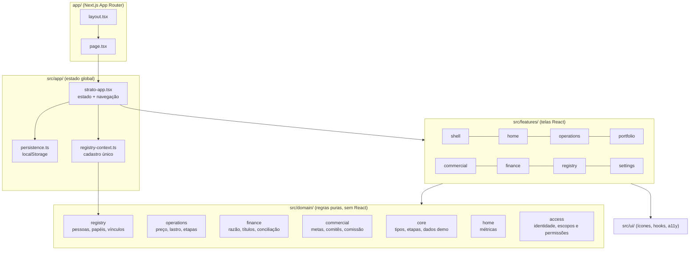
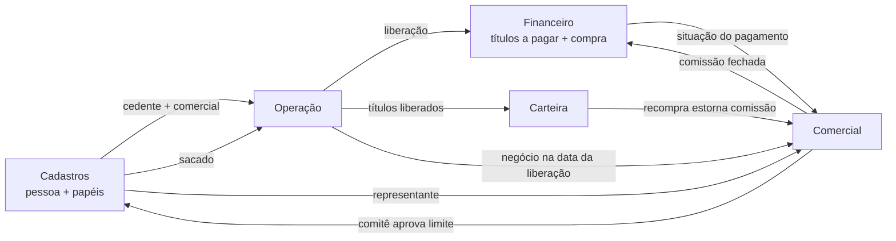

# Arquitetura do STRATO

Aplicação navegável de uma plataforma operacional de recebíveis (factoring, securitizadora, FIDC). Nesta etapa, os dados operacionais são demonstrativos e ficam no `localStorage`. A trilha de decisões, as notificações e o diretório de acesso usam APIs conectadas ao PostgreSQL privado do Supabase. O login, o cadastro e a aprovação são próprios do STRATO; o Supabase Auth não participa mais da aplicação.

## 1. Visão em camadas


```mermaid
flowchart TB
  subgraph Rotas["app/ (Next.js App Router)"]
    L[layout.tsx] --> P[page.tsx]
  end
  subgraph App["src/app/ (estado global)"]
    R[strato-app.tsx<br/>estado + navegação]
    PS[persistence.ts<br/>localStorage]
    RC[registry-context.ts<br/>cadastro único]
  end
  subgraph Features["src/features/ (telas React)"]
    SH[shell] --- HO[home] --- OP[operations] --- PO[portfolio]
    CO[commercial] --- FI[finance] --- RG[registry] --- ST[settings]
  end
  subgraph Domain["src/domain/ (regras puras, sem React)"]
    CORE[core<br/>tipos, etapas, dados demo]
    OPS[operations<br/>preço, lastro, etapas]
    FIN[finance<br/>razão, títulos, conciliação]
    COM[commercial<br/>metas, comitês, comissão]
    REG[registry<br/>pessoas, papéis, vínculos]
    HM[home<br/>métricas]
    AC[access<br/>identidade, escopos e permissões]
  end
  UI["src/ui/ (ícones, hooks, a11y)"]
  P --> R
  R --> PS
  R --> RC
  R --> Features
  Features --> Domain
  Features --> UI
  RC --> REG
```

Regras de dependência (valem como contrato):

| Camada             | Pode importar                                                                                                                                                       | Não pode importar                          |
| ------------------ | ------------------------------------------------------------------------------------------------------------------------------------------------------------------- | ------------------------------------------ |
| `src/domain`       | outros módulos de `src/domain`                                                                                                                                      | React, `src/features`, `src/app`, `src/ui` |
| `src/features/<x>` | `src/domain`, `src/ui`, `src/app/registry-context`, `src/features/shell/shell-context` e peças compartilhadas de outra feature quando explícito (ex.: `finance-ui`) | estado de outra feature                    |
| `src/app`          | tudo acima                                                                                                                                                          | —                                          |
| `app/` (rotas)     | `src/app`, `src/features/shell/theme`                                                                                                                               | —                                          |

Isso deixa o domínio testável sem navegador (ver `tests/`) e permite trocar a origem dos dados sem mexer nas telas.

## 2. Mapa de pastas

```
app/                         Rotas do Next (página única) e CSS global
  layout.tsx                 Fontes, metadados, script de tema antes da pintura
  page.tsx                   Monta <StratoApp />
  globals.css                Índice dos estilos (ver seção 6)
  styles/                    tokens.generated.css, legacy.css, commercial.css, design-system.css, ledger.css
src/
  app/
    strato-app.tsx           Raiz: estado global, navegação por view, providers
    persistence.ts           Chaves e migração do localStorage
    registry-context.ts      Contexto do cadastro único (cedentes, pessoas, comercial)
  domain/
    core/                    Entidades (types.ts), etapas (stages.ts), formatação, dados de demonstração (demo/)
    operations/              Precificação, lastro, diagnóstico por etapa, ritmo, automação, criação da operação
    finance/                 Plano de contas (model.ts), razão (ledger.ts), títulos, bancos, liberações,
                             relatórios, conciliação OFX, importação de plano de contas, implantação
    commercial/              Tipos, calendário, regras (atribuição, métricas, comissão), ações, seed
    registry/                Pessoas e papéis (parties.ts), gravação com propagação (party-save.ts),
                             vínculo cedente↔comercial e eventos da carteira (registry.ts)
    home/                    Métricas da Visão geral e parâmetros (metas, cenários)
    risk/                    Índice de qualidade explicável, política de qualidade (pesos, faixas, PDD,
                             parâmetros dos indicadores), rolagem, safras, concentração (HHI) e cobrança
    indicators/              Indicadores de mercado por tela (carteira, originação, esteira, comercial,
                             financeiro, cadastro), funções puras com teste em tests/indicators.test.ts
    access/                  Usuários, identidade autenticada, visão simulada, escopos e permissões por módulo/ação
  features/
    shell/                   Barra superior com módulos (menu responsivo: Plataforma ▾, painel no tablet,
                             folha no celular), menu do usuário (empresa e tema), busca Ctrl K, alertas
    home/                    Visão geral (perfis Gestão, Operação, Risco)
    operations/              Central, Nova operação e o workspace com as 6 etapas
      central/ new-operation/ workspace/ entry/ risk/ lastro/ pricing/ approval/ release/ components/
    portfolio/               Carteira (títulos, por cedente, por comercial, atraso)
    commercial/              Comercial (painel, carteira, negócios, contas novas, visitas, funil, comitês, comissões)
    finance/                 Financeiro (caixa, títulos, liberações, extrato, conciliação, contábil, bancos)
    registry/                Cadastros (pessoas com papéis, cedentes, sacados)
    settings/                Usuários e acesso, empresas, padrões, políticas, integrações e preferências
    risk/                    Painel de Risco: qualidade dos clientes, cobrança, rolagem, safras, critérios
    indicators/              IndicatorGrid (grade de indicadores com a fonte de cada número)
  ui/                        Ícones, pressable (a11y), useElementWidth
tests/                       Vitest: documentos, cadastro, preço, financeiro, comercial
tools/theme_tokens.py        Gera tokens claro/escuro a partir de cores literais do CSS
tools/sites-vite-plugin.ts   Empacota os metadados opcionais da hospedagem no build
docs/                        Arquitetura, testes, plano de IA e referências do produto
```

Cada arquivo começa com um comentário dizendo o que ele faz. Nenhum arquivo de componente passa de ~700 linhas; os painéis grandes foram divididos em subcomponentes, um hook de estado (`use-*.ts`) e um modelo puro (`*-model.ts`) na mesma pasta.

## 3. Estado, persistência e navegação

`src/app/strato-app.tsx` é o único dono do estado global:

| Estado                              | Tipo                    | Chave no localStorage           |
| ----------------------------------- | ----------------------- | ------------------------------- |
| operações                           | `Operation[]`           | `lastro-mvp-operations-v3`      |
| sacados                             | `Debtor[]`              | `lastro-mvp-debtors-v1`         |
| financeiro                          | `FinanceState`          | `strato-finance-v2`             |
| comercial                           | `CommercialState`       | `strato-commercial-v1`          |
| pessoas do Cadastro                 | `Party[]`               | `strato-parties-v1`             |
| usuários e acessos                  | `AccessState`           | `strato-access-v1`              |
| tarefas e notificações              | `TaskState`             | `strato-tasks-v1`               |
| explicações na interface            | `boolean`               | `lastro-interface-guidance-v1`  |
| tema, perfil/período da Visão geral | preferências do usuário | `strato-theme`, `strato-home-*` |

A trilha de decisões é a primeira exceção a esse armazenamento local: `app/api/decisions/route.ts` valida tenant, sessão, permissão, alçada e chave de idempotência, e `src/server/decisions/repository.ts` grava eventos versionados no PostgreSQL privado. As migrações em `supabase/migrations/` criam o ledger imutável, a deduplicação e a outbox; evento, reivindicação idempotente e mensagem pendente são gravados na mesma transação. `src/server/outbox/publisher.ts` entrega as mensagens para `decision_notifications`, aplica backoff, encerra após cinco falhas e resolve tarefas por novos eventos. A interface aciona o publicador autenticado para atualização imediata; o agendamento externo pode reutilizar o mesmo serviço.

O diretório de identidade e autorização também é sincronizado com o PostgreSQL por `app/api/access/users/route.ts`. A autenticação pertence ao STRATO: a pessoa cria uma solicitação com senha, permanece pendente e só entra depois de um administrador definir departamento, função, empresas, permissões e alçadas. `src/server/access/password.ts` aplica PBKDF2 com sal individual; `src/server/access/session.ts` emite token opaco em cookie `HttpOnly` e persiste somente o hash; `src/server/access/repository.ts` resolve vínculo, escopo, permissões e alçadas, além de bloquear tentativas repetidas. O bootstrap automático de demonstração existe somente em `localhost`; a primeira credencial externa é criada pelo comando administrativo de uso único.

O ambiente definitivo usa o projeto Supabase `STRATO`, na região de São Paulo, exclusivamente como PostgreSQL gerenciado. As migrações em `supabase/migrations/` criam o esquema `private`, não exposto diretamente pela Data API, com credenciais internas, sessões opacas, diretório de acesso, ledger, idempotência, outbox e notificações. `src/server/database/postgres.ts` mantém um pool pequeno, conexão criptografada e comandos sem prepared statements para compatibilidade com o pooler. O navegador não carrega cliente, chave pública, sessão do Supabase Auth ou conexão do banco.

- A restauração acontece uma vez, depois de montar (`loadPersistedState`), e mescla o que foi salvo com os dados de demonstração atuais (migração tolerante a campos novos).
- "Restaurar dados de demonstração" (busca global) chama `clearPersistedState` e recria o seed.
- A navegação usa `view` e aceita links diretos controlados por permissão; `selected` abre o workspace de uma operação autorizada.

Dois contextos descem da raiz:

- `ShellContext` (`features/shell/shell-context.ts`): operações, navegar, abrir operação, nova operação, preferências, restaurar demonstração. Usado pelo shell, pela busca e pelos alertas.
- `RegistryContext` (`app/registry-context.ts`): cedentes efetivos (limite do comitê aplicado), pessoas do Cadastro, estado comercial com os eventos da carteira e as ações `saveParty` e `onCommercial`.

## 4. Vínculos entre módulos (ciclo fechado)


```mermaid
flowchart LR
  CAD[Cadastros<br/>pessoa + papéis] -->|cedente + comercial| OP[Operação]
  CAD -->|sacado| OP
  CAD -->|representante| COM[Comercial]
  COM -->|comitê aprova limite| CAD
  OP -->|liberação| FIN[Financeiro<br/>títulos a pagar + compra]
  OP -->|títulos liberados| CAR[Carteira]
  OP -->|negócio na data da liberação| COM
  CAR -->|recompra estorna comissão| COM
  COM -->|comissão fechada| FIN
  FIN -->|situação do pagamento| COM
```

Regras implementadas (arquivo de referência entre parênteses):

- O CNPJ/CPF é a chave de tudo; uma pessoa pode ter vários papéis (`domain/registry/parties.ts`).
- Gravar um cadastro propaga: sacado entra na digitação, representante vira comercial, cedente cria ou transfere o vínculo com o comercial (`domain/registry/party-save.ts`).
- O limite do cedente vem da decisão do comitê (`effectiveCedents` em `domain/registry/registry.ts`).
- A operação grava o comercial responsável quando nasce (`domain/operations/create-operation.ts`); o negócio conta na data da liberação para o dono do cliente naquela data (`repAt`, `liveDeals` em `domain/commercial/rules.ts`).
- Liberação gera títulos a pagar e o lançamento da compra (`domain/finance/releases.ts`).
- Recompras feitas nas operações viram eventos da carteira e estornam comissão (`repurchaseEvents` + `computeCommission`).

## 5. Padrões do domínio

- **Funções puras que devolvem resultado:** ações retornam `{ state, error?, message?, effects? }` (`Result` no financeiro, `CResult` no comercial). A tela aplica o novo estado ou mostra o erro; nada lança exceção para a interface.
- **Transação no financeiro:** `run(state, fn)` trabalha num rascunho (`draftOf`), e `post` recusa lançamento desbalanceado. Se qualquer passo falha, o estado original fica intacto.
- **Nada é apagado:** títulos são excluídos com motivo e estorno, baixas são estornadas por contrapartida, operações são canceladas com memória, cadastros são inativados.
- **Uma fonte por cálculo:** a precificação (`domain/operations/pricing.ts`) é a mesma para Preço, Aprovação, Visão geral e Comercial; o parser monetário (`parseMoneyBR`) é único no financeiro.
- **Datas** em ISO `AAAA-MM-DD` no estado; formatação `dd/mm/aaaa` só na tela.

## 6. Estilos e tema

`app/globals.css` importa, nesta ordem:

1. `styles/tokens.generated.css` — cada cor das telas legadas vira `var(--c-<papel>-<hex>)` com valor claro e escuro, gerados por `tools/theme_tokens.py` a partir do papel da cor (texto, fundo, borda, destaque). Não editar à mão.
2. `styles/legacy.css` — estilos das telas de operação, Visão geral (`vg-`) e Financeiro (`fn-`).
3. `styles/commercial.css` — Comercial (`cm-`).
4. `styles/design-system.css` — tokens semânticos `--ds-*`, shell (`sx-`), componentes novos (`ds-`, `rg-`, `pf-`).
5. `styles/ledger.css` — padrão visual atual (v10): barra superior com módulos em ícones, títulos grandes com trilha, bloco de caixa da Visão geral, cartões sem borda, abas de texto, gauge e o tratamento comum dos módulos.

Estilos novos usam os tokens `--ds-*`, que já têm valor claro e escuro. O tema é `data-theme="light|dark"` no `<html>`, com a preferência do usuário (claro, escuro ou sistema) salva em `strato-theme`.

## 7. Testes e qualidade

```
npm run check     # typecheck + lint + formatação + testes
npm test          # Vitest (tests/*.test.ts)
```

- Testes cobrem as regras que mais custam caro se quebrarem: dígitos de CPF/CNPJ, validação e propagação do cadastro, métodos de deságio, partidas dobradas e estorno, parser monetário, atribuição e comissão.
- ESLint roda sem erros nem avisos. As poucas exceções (`eslint-disable`) têm o motivo escrito ao lado — em geral, restauração do localStorage depois de montar.
- O servidor Node, as rotas e o adaptador PostgreSQL participam do typecheck; o build de produção valida os pacotes RSC, SSR e cliente.

## 8. Como fazer mudanças comuns

- **Nova regra de negócio:** escreva a função em `src/domain/<área>/`, sem React, com teste em `tests/`. A tela só chama a função.
- **Nova tela num módulo:** crie o componente em `src/features/<módulo>/` (ou numa subpasta da etapa) e ligue na aba ou na etapa correspondente.
- **Novo módulo no menu:** acrescente a `view` em `AppView` (`shell-context.ts`), o item em `navigation.tsx` e o `case` de renderização em `strato-app.tsx`.
- **Novo papel no Cadastro:** acrescente em `PartyRole`, `partyRoles`, `PartyRoleData` e `defaultRoleData` (`parties.ts`), a ficha em `party-role-fields.tsx` e as colunas em `parties-tab.tsx`.
- **Trocar a demonstração por API:** substitua os `initial*`/`seed*` e o `persistence.ts` por chamadas ao backend; as funções de domínio continuam as mesmas.
- **Implantar a inteligência assistiva:** siga [architecture/PLANO_ESTRUTURA_IA.md](./architecture/PLANO_ESTRUTURA_IA.md). O modelo interpreta e redige; consultas, cálculos, políticas, alçadas e ações continuam em serviços determinísticos e auditáveis.

## 9. Limitações conhecidas

- Login, sessões, usuários, vínculos, permissões, alçadas, trilha de decisões e outbox já usam o adaptador PostgreSQL. Em `localhost`, a entrada demonstrativa permanece como alternativa explícita. A publicação na Hostinger e a migração dos demais estados operacionais ainda são etapas de produção.
- Integrações (Receita, SEFAZ, bureaus, bancos, assinatura) são simuladas.
- A Mesa Inteligente ainda reconhece arquivos por nome e extensão; leitura real de conteúdo, OCR e modelo externo pertencem às fases seguintes.
- A ordem de evolução está em [architecture/PLANO_ESTRUTURA_IA.md](./architecture/PLANO_ESTRUTURA_IA.md).
